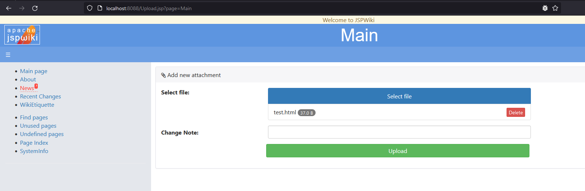
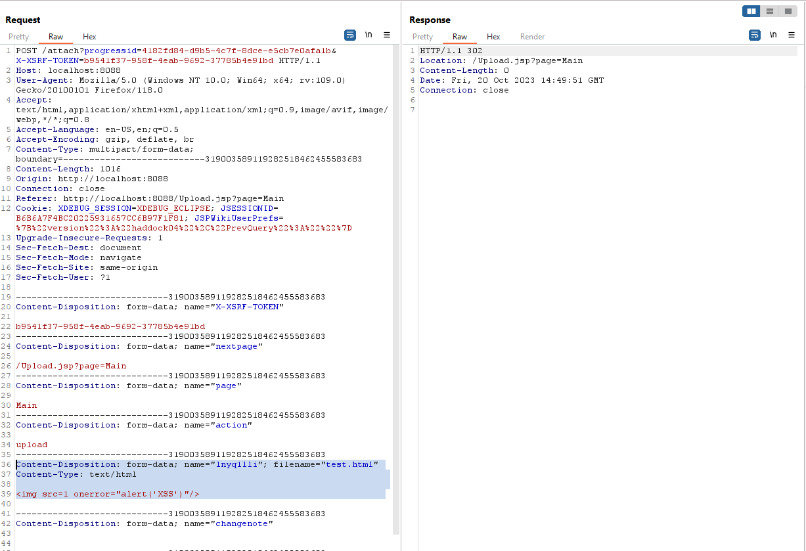
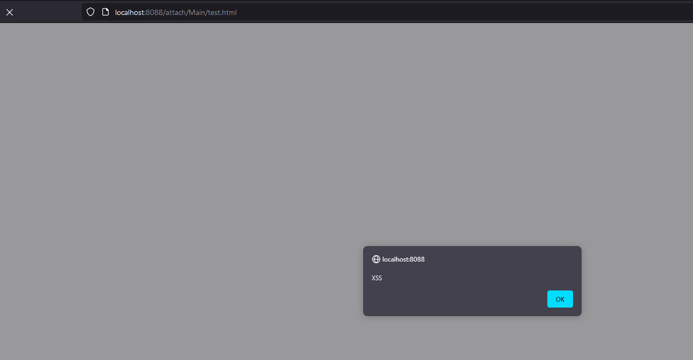

## A Cross Site Scripting vulnerability exists in JSPWiki 2.12.1

### Step to exploit:

1. Navigate to `http://{domain}/Upload.jsp`.

2. Upload html file with content: `` and click on Upload button.

3. Go to file path: `http://{domain}/attach/Main/{filename}`

