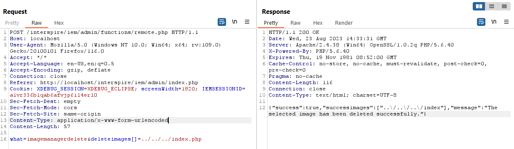
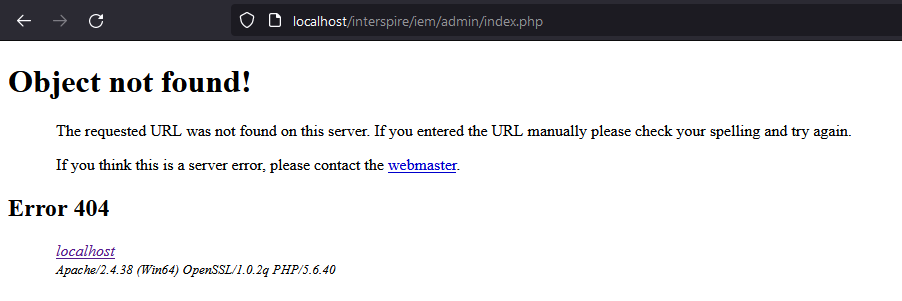

## Path traversal leads to arbitrary file deletions

### Step to exploit:
1. Login as admin.
2. The attacker can delete arbitrary file using POST request "/admin/functions/remote.php" with params: what=imagemanagerdelete&deleteimages[]=../../../../{path_to_file} (e.g. ../../../index.php).

3. Go to /admin/index.php and the file has been deleted.

